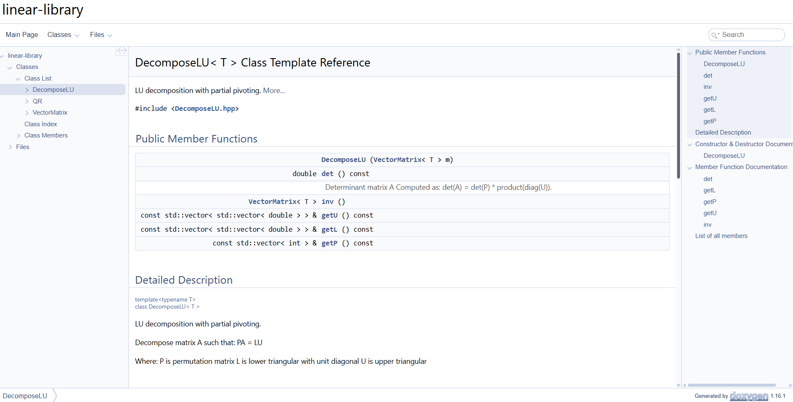
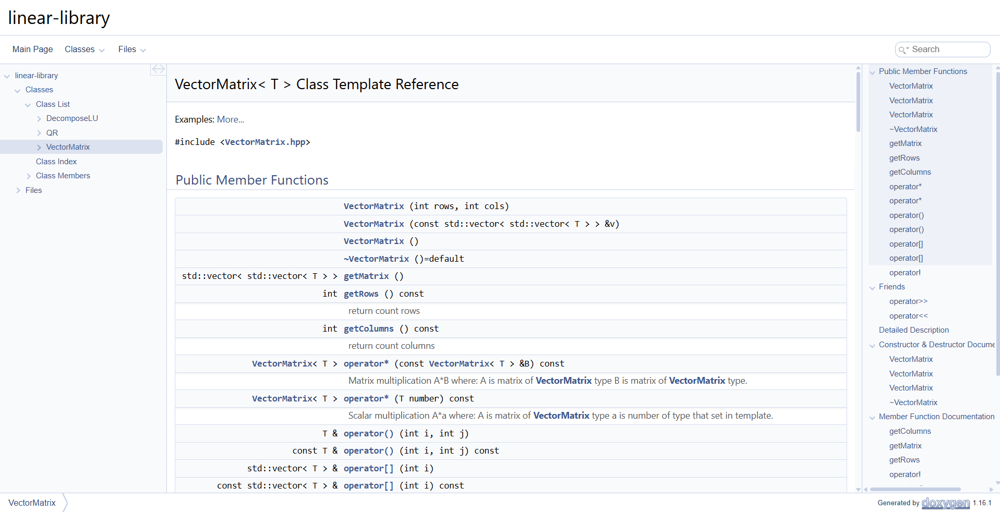
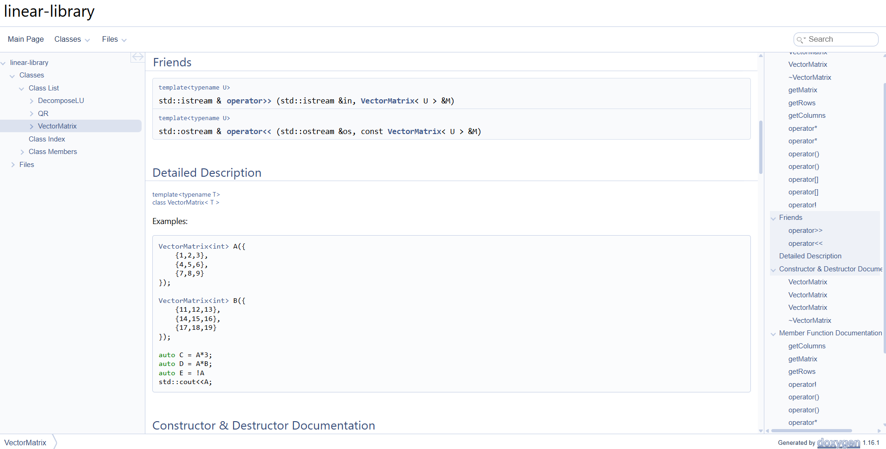

# Linear Algebra Library

A lightweight, header-only C++ library for linear algebra operations, focused on vector matrix, and common decompositions.

## Features

- **Matrix & Vector classes** with intuitive operator overloading
- Basic operations: transpose of matrix, multiplication,multiplication on scalar
- Advanced linear algebra methods:
  - LU Decomposition
  - Other matrix decompositions (in progress)
- Efficient memory management
- CMake build system support
- Unit tests included
- Doxygen documentation
- Automatic documentation publishing via CI is planned.

## Project Structure
```bash
linear-library/
├── docs/                     # For doxygen docs
├── include/
│   └── linear-algebra/LU     # Header-only library source
│   └── linear-algebra/QR
│   └── linear-algebra/vector_matrix  
├── tests/                  # Test suite
├── CMakeLists.txt          # Build configuration
└── README.md
```
## Requirements

- **C++17** or higher
- CMake 3.10+
## Contributors
## Building the Project

1. Clone the repository:
   ```bash
   git clone https://github.com/web-dev137/linear-library.git
   cd linear-library
   mkdir build && cd build
   cmake ..
   cmake --build .
   ```
   Windows:
   ```bash
   mkdir build
   cd build
   cmake -G "MinGW Makefiles" ..
   make

## Generate docs 
cmake --build build --target doc
## Examples docs




## Running Tests
After building, you can run the tests from the build directory
```bash
ctest
# or run the test executable directly if available
```
## Clients
## Example of client Cmake:
```cmake
cmake_minimum_required(VERSION 3.14)
project(RandomMathApp LANGUAGES CXX)

include(FetchContent)

FetchContent_Declare(
    LinearAlgebra
    GIT_REPOSITORY https://github.com/web-dev137/linear-library.git
    GIT_TAG linear-library
)

FetchContent_MakeAvailable(LinearAlgebra)

add_executable(random_math_app main.cpp)

target_link_libraries(random_math_app PRIVATE LinearAlgebra::LinearAlgebra)
target_compile_features(random_math_app PRIVATE cxx_std_17)
```

## Usage of example
```c++
#include <iostream>
#include <linear-algebra/LU/DecomposeLU.hpp>
#include <memory>

int main() {
    using namespace LinearAlgebra;
    auto A = VectorMatrix<double>({
            {0, 2, 1},
            {1, 1, 0},
            {2, 1, 1}
    });

    auto lu = DecomposeLU<double>(A);

    std::cout << "\ndet:\n" << lu.det();
}
```
